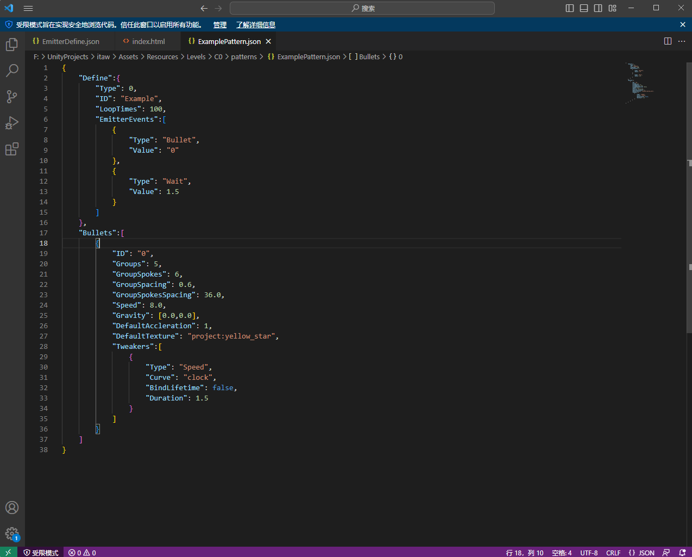

# 快速开始

> 快速开始关卡设计的不二之选

## 简述

在本章的教学中,你将学会如下内容

* 如何安装一款合适的文本编辑器
* json格式基础知识
* 关卡文件结构
* 创建你的第一束弹幕

从零开始的教程

## 开始之前

在开始之前,您可以下载我们的样例工程

[传送](https://cdn-1256624119.cos.ap-nanjing.myqcloud.com/Example.zip)

## 文本编辑器的选择

我们的关卡设计文件基本格式采用的是json格式,不知道这是啥?那就跟着看吧

看看你电脑里自带的文本编辑器:

* 记事本:只是用来写字的,没有错误提示没有语法高亮,感觉不如那啥
* Word系软件:论文编辑器罢了(;^\_^)
* 写字板: 哦我的上帝啊,忘了它吧

因此,我们需要一款能够支持json格式的文本编辑器,幸运的是,你有如下选择

* VSCode: 微软的亲儿子,大量的插件与中文支持,是程序员的瑞士军刀
* Sublime: 比Vscode轻量一些,但是我没用过因此看你咯
* Notepad++: 很小巧的软件,但是因为[某些原因](https://zhuanlan.zhihu.com/p/609192758),所以我们并不会使用
* ~~CEC-IDE: 6~~

因此,我们的教程以VSCode为范例来进行

### 安装

打开链接: [传送](https://code.visualstudio.com/)


下载慢请尝试科学方式下载,**这是一款免费软件!!!!!**


然后选择Download for Windows(你用啥系统就下哪个)

下载完成后直接运行安装,一般只需要无脑下一步即可

默认来说,它会自动绑定json文件

<figure><figcaption></figcaption></figure>

## Json格式基本教学

简单的教程: [传送](https://zhuanlan.zhihu.com/p/605430247)

然后我会在接下来的内容里逐渐教你去写

## 项目文件结构

```
Level                         
├─ patterns                
│  └─ ExamplePattern.json  
├─ song                           
│  └─ test.ogg             
├─ sprites                 
│  └─ bu.png               
├─ EmitterDefine.json      
└─ manifest.json           
```

* patterns: 文件夹,用来存储弹幕样式
* song: 文件夹,用来存储歌曲文件,请统一使用ogg格式
* sprites: 文件夹,用于存储额外的弹幕贴图,您可以使用游戏内自带的贴图也可以使用自己的贴图
* EmitterDefine.json: 用来定义弹幕发射器的网格位置,出现与消失时间,以及其动画
* manifest.json: 项目的描述文件

不过现在的你并不需要在意这些文件的具体内容

## 前期准备

### 歌曲文件

目前来说我们的框架只能接受ogg格式的音频文件,因此请将音频转换为ogg格式,这里推荐使用**格式工厂**来进行

转换好以后,就请将歌曲文件复制进入song目录

### 谱面设计思路

在说思路之前,先说一下游戏的战斗具体玩法到底是什么

* 玩家会在指定的16:9的屏幕区域进行boss战，使用**AD**左右移动,**Space**跳跃,**鼠标右键**冲刺一段距离,左键发射弹幕
* 屏幕上的弹幕按照音乐节拍进行同步发射
* 屏幕下方有一个十字的判定线,分为左右两侧,两侧分别从最左端或最右端发射note移动到中间,当左侧的note落到中间的竖判定线时,请点击**W**键,右侧的请点击**E**键,两侧同时判定的note会有一圈黄色荧光,请同时点击
* boss拥有生命条与韧性条,使用近战攻击可以消耗韧性条,韧性条消耗尽以后会有2s的停滞,并且两秒后的十秒内近战远程伤害均会大幅上升,10s后韧性条重置
* 一首曲子大约2min左右,弹幕的样式和玩法特性会根据关卡特性进行变化
* 同时根据节奏的近战攻击可以积攒技能条,积攒到1/3可以释放一次小技能,积攒满了可以释放大技能

基于此,那么关卡的设计建议

* 下方判定线的采音可以更多的采集重音,不需要很多,但是一定要符合直觉
* 在下方判定线即将出现note的时候,弹幕设计的时候可以不那么刻意的引导玩家贴近boss
